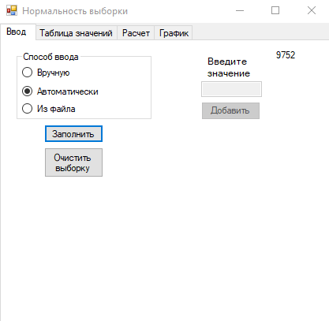

# Normality of sample
 My course project on C#
# About
This is my course project on C#. The main topic is the definition of sampling normality. Sample can contain only integers from 1000 to 1000000. The sample size is set randomly. user can set the sample manually, automatically and enter from a file. At the second page user can see and change all the values.  
​

The result of the program is probability that the sample is normal. Also, the characteristics of the sample are calculating and printing. All this can be printed on the screen, in a file or sent to print.
Also, the user can see a graph of the normal distribution for such a sample and what it really is.
